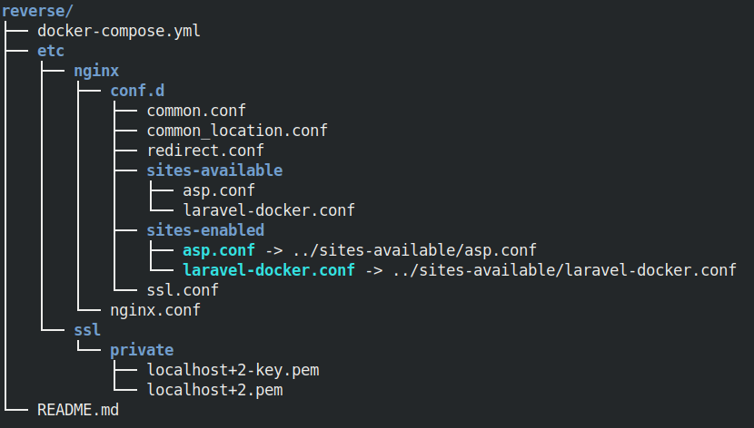

# nginx-reverse-proxy project
Multiple local domains on localhost through nginx-proxy, SSL certificates (mkcert) and Docker
## Introduction
Set up an easy and secure reverse proxy with Docker, Nginx & local ssl sertificate.
You can have on localhost:
1. Multiple services (apps, sites) by local domains
2. SSL certificates 
3. Docker container Nginx
## Host computer requirements
You should have:
- OS Linux (when using other systems, there may be nuances, but I'm not sure)
- Docker version 17.12.0+, and Compose version 1.21.0+.
- mkcert (valid https certificates for localhost)
## Folders and files

```html
    
```


